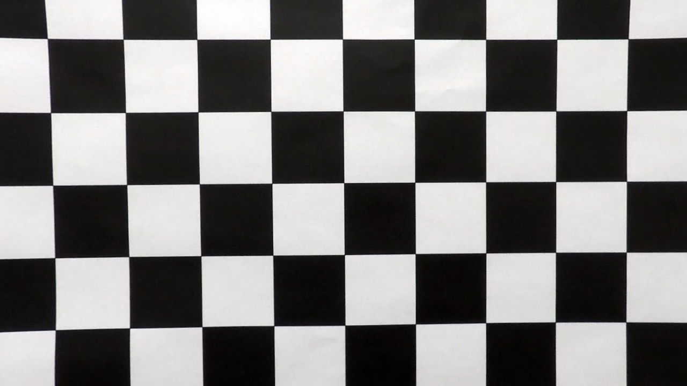
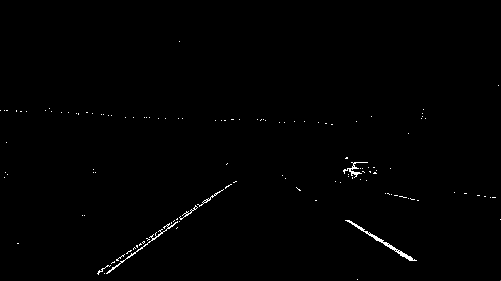
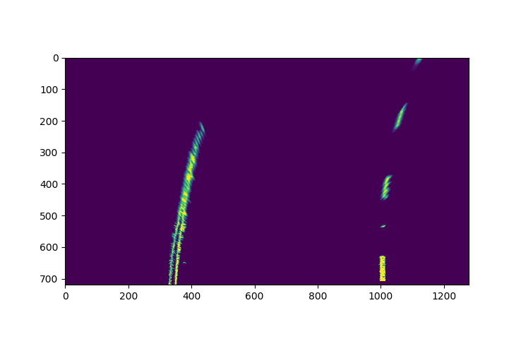
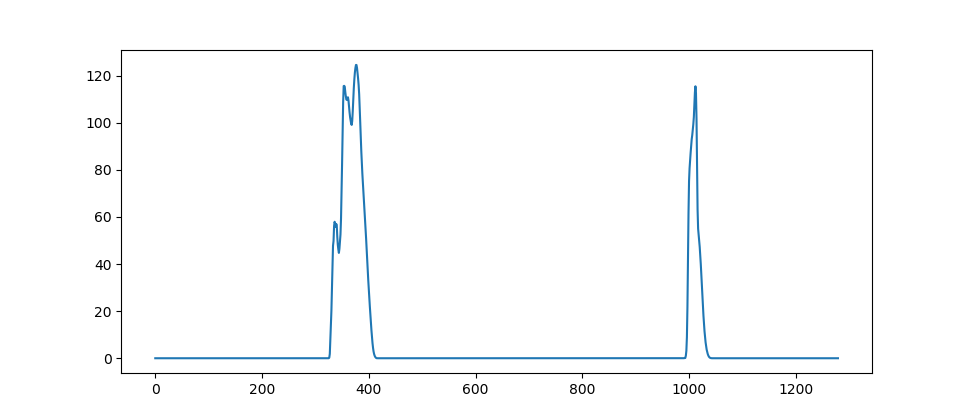
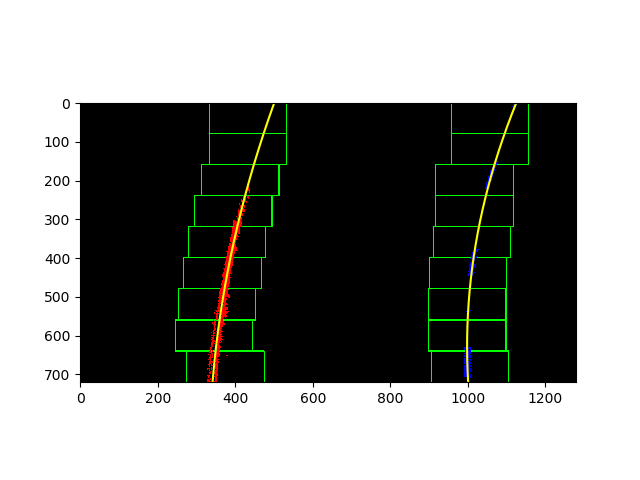
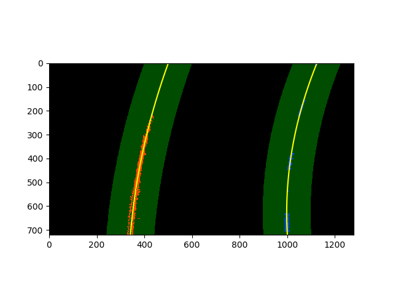
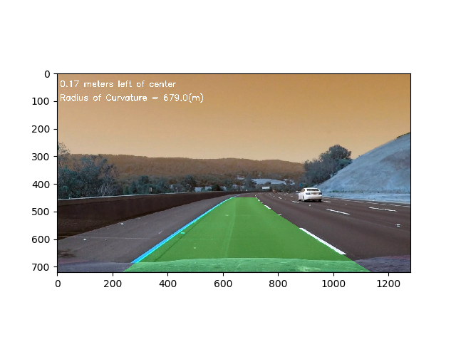

**Advanced Lane Finding Project**

Bo Fan

The goals / steps of this project are the following:

* Compute the camera calibration matrix and distortion coefficients given a set of chessboard images.
* Apply a distortion correction to raw images.
* Use color transforms, gradients, etc., to create a thresholded binary image.
* Apply a perspective transform to rectify binary image ("birds-eye view").
* Detect lane pixels and fit to find the lane boundary.
* Determine the curvature of the lane and vehicle position with respect to center.
* Warp the detected lane boundaries back onto the original image.
* Output visual display of the lane boundaries and numerical estimation of lane curvature and vehicle position.


## [Rubric](https://review.udacity.com/#!/rubrics/571/view) Points

### Here I will consider the rubric points individually and describe how I addressed each point in my implementation.  

---


### Camera Calibration

#### 1. Computation of camera matrix and distortion coefficients.

The code for this step is contained in lines 12-33 of the file called `my_pipeline.py`.  
I start by preparing "object points", which have (x, y, z) coordinates in the world. Here I am assuming the chessboard is fixed on the (x, y) plane at z=0. Thus, `objp` is just a replicated array of coordinates, and `objpoints` will be appended with a copy of it once I successfully detect all chessboard corners.  `imgpoints` will be appended with the (x, y) pixel position of each corner under successful detection.  
I then used `objpoints` (3d) and `imgpoints` (2d) to compute the camera calibration matrix and distortion coefficients by calling the `cv2.calibrateCamera()` function.  I applied this distortion correction to the test chessboard image using the `cv2.undistort()` function and obtained the following results: 




### Pipeline (single images)

#### 1. An example of a distortion-corrected image.
The code can be found in lines 54-57.
When I apply the distortion correction to a test image (test3.jpg), I get the following results:


#### 2. Use Color transforms, gradients to create a thresholded binary image.
The code is contained in lines 76-106. I combined color and gradient thresholding to generate a binary image. In my experiments, sobelx gradients are used to pick pixels from strong edges or corners. I also applied channel S (from the HLS space) and  channel R thresholding (from the RGB colorspace) to find useful pixels. By combining the color and sobelx gradient thresholding, I find several edges and curves match the left and right lines quite well. Here's an example of my output for this step.



#### 3. Perspective transform

The code for my perspective transform includes a function called `corners_warp()`, which appears in lines 54 through 73 in the file `my_pipeline.py`.  The `corners_warp()` function takes as inputs an image (`img`), and use source (`src`) and destination (`dst`) points. I choose the source and destination points in the following manner:

```python
src = np.float32([[700,450],[1100,img_size[1]],[180,img_size[1]],[600,450]])
offset = 300 # offset for dst points
dst = np.float32([[img_size[0]-offset, 0],[img_size[0]-offset, img_size[1]], [offset, img_size[1]],[offset, 0]])
```
This resulted in the following source and destination points:

| Source        | Destination   | 
|:-------------:|:-------------:| 
| 700, 450      | 980, 0        | 
| 1100, 720      | 980, 720      |
| 180, 720     | 300, 720      |
| 600, 450      | 300, 0        |

I verified that my perspective transform was working as expected, and the lines in the warped version appear parallel.



#### 4. Identify lane-line pixels and fit their positions with a polynomial
The code can be found in lines 152-237 and 299-358.
For the first image from a video, I used a histogram to decide the initial search position of x by projecting the number of positive pixels on to the x axis. The middle position of the left and right lanes will be obtained according to the two peaks in the histogram, and applied to define the parameters of the sliding window. Positive pixels inside each window are used to compute the expected lane lines.



For the second or the other images, the search region will be generated from the Line class without searching the whole area.
When there are any errors in fitting the lines, the pipeline will use average polynomial coefficients from the recent 5 images.  
Then I fit my lane lines with a 2nd order polynomial like this:




#### 5. Calculate the radius of curvature of the lane and the position of the vehicle with respect to center.

I did this in lines 126-136 and 239-255 in `my_pipeline.py`. Position of the vehicle with respect to center is the difference between middle of the lane and the car, where the center of the car is just the middle x position from the camera image. The center of the lane is computed by the average x positions of the left and right lane lines. 


#### 6. Provide your result plotted back down onto the road with the detected lane area.

I implemented this step in lines 333-358 in my code in `my_pipeline.py` in the function `draw_lines()`. Here is an example of my result on a test image, where the car is 0.17m left of center and radius of curvature is 679m :



---

### Pipeline (video)

#### 1. Provide a link to your final video output.  Your pipeline should perform reasonably well on the entire project video (wobbly lines are ok but no catastrophic failures that would cause the car to drive off the road!).
The detected video file is called detected_video.mp4 in the current folder.
Here's also a [link to my video result](https://github.com/akb46mayu/UdacitySelfDrivingCar_ND1/blob/master/AdvancedLaneFinding/detected_video.mp4)

---

### Discussion

#### 1. Briefly discuss any problems / issues you faced in your implementation of this project.  Where will your pipeline likely fail?  What could you do to make it more robust?

The first problem is the running time of the processing pipeline is too long. Initially, my pipeline runs very slow on the input video. Then I found that I calibrated the camera each time when loading a new image. Thus, I calibrate only once, and it improves the processing speed.

The second problem is the thresholding of the r and s channels are not properlly chosen. So the detection pipelines fail on the frames from the last 20 seconds in the video where shadows from trees appear on the road. Therefore, I carefully choose the r and s channel thresholds to make it detect the lines better. 

The radius and the distance to center are not computed correctly initially, where I got 1.5m distance to the center.
Then, I visualized the detected lanelines, and found a bug in my code, where I did not update the parameters of the right line.
After fixing the bug, the distance and radius can be computed correctly. 

My pipeline does not work well for the challenge video, because there is a third line in the middle of the left and right lane lines on the road. I will use advanced lane line detection algorithm and consider about the obstacle or interference in future work.

#### 2. How to improve it in the future.
In the gradient thresholding step, I only used sobelx gradient, because I did not have enough time. If given more time, I will use the magnitudes or the directions of the gradients. 
The parameters for the perspective transform are chosen mannually. I will use novel methods such as deep learning models or region proposals to select those parameters automatically.


