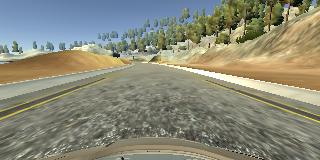
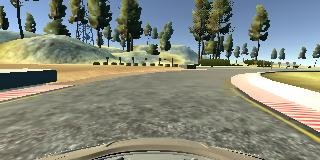
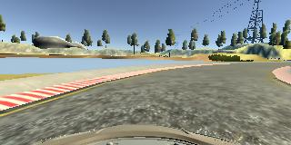
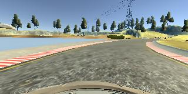
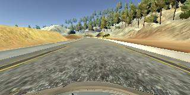
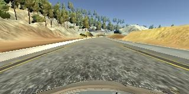
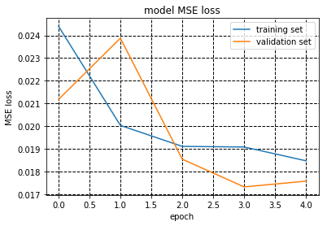

# **Behavioral Cloning** 
---

**Behavioral Cloning Project**

The goals of this project are the following:
* Use the simulator to collect data of good driving behavior
* Build, a convolution neural network in Keras that predicts steering angles from images
* Train and validate the model with a training and validation set
* Test that the model successfully drives around track one without leaving the road
* Summarize the results with a written report


### Files Submitted & Code Quality

#### 1. Submission includes all required files and can be used to run the simulator in autonomous mode

My project includes the following files:
* model.py containing the script to create and train the model
* drive.py for driving the car in autonomous mode
* model.h5 containing a trained convolution neural network 
* writeup_report.md or writeup_report.pdf summarizing the results

#### 2. Submission includes functional code
Using the simulator and drive.py file, the car can be driven autonomously around the track by executing 
```sh
python drive.py model.h5
```

#### 3. Submission code is usable and readable
The model.py file contains the code for training and saving the model parameters of CNN. The file shows the pipeline I used for training and validating the model, and it contains comments to explain how the code works.

### Model Architecture and Training Strategy

#### 1. An appropriate model architecture has been employed

My model consists of a convolution neural network with 5x5 or 3x3 filters and depths between 24 and 64. 
The model includes RELU layers to introduce nonlinearity, and the data is normalized in the model using a Keras lambda layer. 

#### 2. Attempts to reduce overfitting in the model

I used two dropout layers to reduce overfitting. The model was trained and validated on different data sets to prevent overfitting. The model was tested by running it through the simulator (autonomous mode) and ensuring that the vehicle could stay on the track.

#### 3. Model parameter tuning

The model used an adam optimizer, so the learning rate was not tuned manually.

#### 4. Appropriate training data
Training data was chosen to keep the vehicle driving on the road. I used a combination of center lane driving, recovering from the left and right sides of the road with a small correction angle of 0.13. For details about how I created the training data, see the next section. 

### Architecture and Training documentation 

#### 1. Solution Design Approach

The overall strategy for deriving a model architecture were the following. My first step was to use a convolution neural network model similar to Nvidia's network. In order to test how well the model was working, I split my image and steering angle data into a training and validation set. I found that my first model had a low mean squared error on the training set but a high mean squared error on the validation set. This implied that the model was overfitting. 

To combat overfitting, I modified the model by adding two dropout layers so that the mse of validation decreased from epoch 0 to 3. The final step was to run the simulator to see how well the car was driving around track one. There were a few spots where the vehicle fell off the track or went into the river. To improve the driving behavior in these cases, I cropped the input images. Then I did data augmentation by driving the car clockwise, making sharp turns before it hit the sides of the roads, using images from left and right camers, and flipping the input images on the fly. At the end of the process, the vehicle was able to drive autonomously around the track without leaving the road.

#### 2. Final Model Architecture
The final model was build according to Nvidia's network's architecture (https://images.nvidia.com/content/tegra/automotive/images/2016/solutions/pdf/end-to-end-dl-using-px.pdf).
The final model architecture had a normalization layer followed by 5 convolutional layers and 5 fully connected layers. 


#### 3. Creation of the Training Set & Training Process

To capture good driving behavior, I first recorded 1.5 laps on track one using center lane driving. Here is an example image of center lane driving:



I also captured the images by driving the car clockwise.



For each center image, I used the left and right view images and added a correction angle to generate more training samples. I then recorded the vehicle recovering from the left side or right sides of the road back to center so that the vehicle would learn to turn sharply. These images show what a recovery looks like:




To augment the data set, I also flipped images and angles using the generator function thinking that this would double the number of training samples. For example, here is an image that has then been flipped:




After the collection process, I had more than 9000 number of data points. I then preprocessed this data by adding a normalization layer. I finally randomly shuffled the data set and put 30% of the data into a validation set. 
I used this data for training the model. The validation set helped determine if the model was over or under fitting. The ideal number of epochs was 4 to 5 as evidenced by the following loss plot.



I used an adam optimizer so that manually training the learning rate wasn't necessary.

