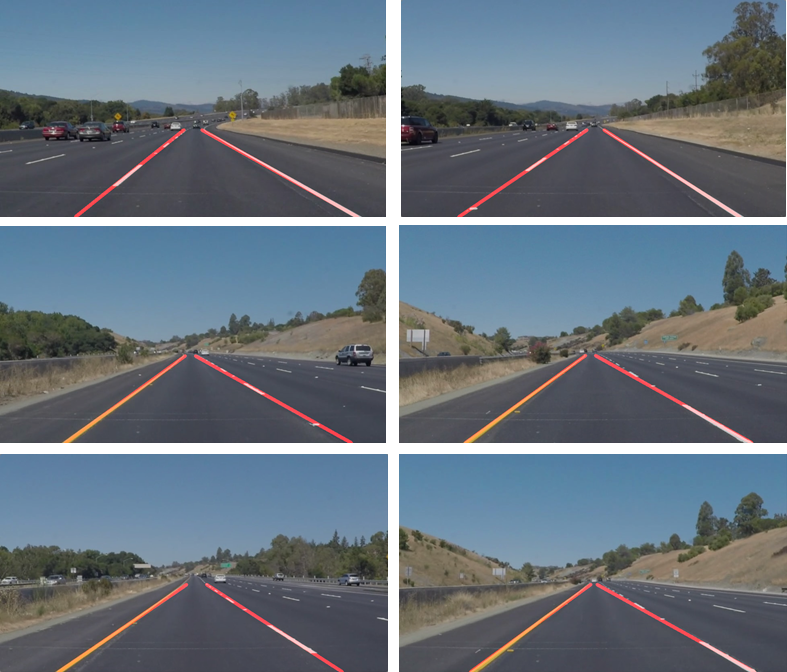

# **Finding Lane Lines on the Road** 

---

**Finding Lane Lines on the Road**

The goals / steps of this project are the following:
* Make a pipeline that finds lane lines on the road
* Apply the pipeline to detect the lane lines on images as well as videos.
* Reflect on your work in a written report

[//]: # (Image References)

[image1]: ./examples/grayscale.jpg "Grayscale"

---

### Reflection

### 1. Describe your pipeline. As part of the description, explain how you modified the draw_lines() function.
#### My pipeline
My pipeline consists of 5 steps: Grayscale conversion and Gaussian filtering, Canny edge detection, ROI masking (edge masking),
Hough transform, and Line segments extrapolation.
Among all of them, region masking is quite important, because we are only interested in lane lines not something in the sky. 
Hough transform helps us to draw line segments using the edges. However, it might generate a bunch of line segments which may not be our targets. Thus, the original drawline function needs to be improved. 
#### Modification of drawlines functions
Without modifying the given helper functions, to make life easier, I write a pipeline function called *detect_lanelines* which completes all the steps above. Three new steps are used to improve the original drawline functions which are 
*collect_lines*, *average_pos*, and *extropolate_line* in my pipeline.
Firstly, using *collect_lines*, I group the line segments computed from Hough Transform. They will be grouped into the left lane line (slope is negative) and right lane line group (slope is positive).
Because the lines might be spread out or discontinued, extropolation is applied to pass through as many candidates as possible. 
Then, I do average opeartion on the slopes as well as the coordinates of two groups. In this way, we get the average slope and 
the average end points of those line segments. Hence, we can detemine the line using an average slope and an average point.
To call the opencv api to draw lines, we need to compute the two end points of the new line by solving a simple linear equation. I use the corner positions from the ROI to compute the endpoints. Additionally, outlier slopes can be removed by using a confidence interval. 

The followings show the detection results from 6 images:

My pipeline nearlly overlaps the groudtruth in all of them.
For the white lane video (in the folder *test_videos_output*), it covers nearlly all of the images with tiny error in some small regions.
For the yellow lane video, it covers most of the lane lines, but some frames show large error, and sometimes the two predicted lane lines intersect with each other. 

### 2. Potential shortcomings with my pipeline
One shortcoming of my approach is that hyperparameters are fixed for all the inputs. Thus, for the yellow lane line video, some frames show large detection errors.
The other shortcoming might be my pipeline can not remove end points which might be outliers, that will also lead to large error when extropolating the lane lines. 

### 3. Possible improvements to my pipeline
For line extropolation, one improvement would be to use linear regression instead of simple average method, and to remove outliers which are end points.
We should also adjust the hyper paraemters to different frames in a video according to lighting condition or road condition. By this method, the detection errors might be decreased.

