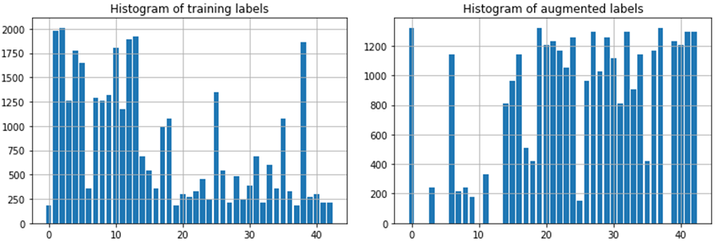

# **Traffic Sign Recognition** 

## Writeup

---

**Build a Traffic Sign Recognition Project**

The goals / steps of this project are the following:
* Load the data set (see below for links to the project data set)
* Explore, summarize and visualize the data set
* Design, train and test a model architecture
* Use the model to make predictions on new images
* Analyze the softmax probabilities of the new images
* Summarize the results with a written report

## Rubric Points
### Here I will consider the [rubric points](https://review.udacity.com/#!/rubrics/481/view) individually and describe how I addressed each point in my implementation.  

---
### Data Set Summary & Exploration

#### 1. Provide a basic summary of the data set. In the code, the analysis should be done using python, numpy and/or pandas methods rather than hardcoding results manually.

I use the pandas library to calculate summary statistics of the traffic signs data set:

* The size of training set is 34799
* The size of the validation set is 4410
* The size of test set is 12630
* The shape of a traffic sign image is (32, 32, 3)
* The number of unique classes/labels in the data set is 43

The following figure shows 15 images from the training samples with their labels.

#### 2. Include an exploratory visualization of the dataset.

Here is an exploratory visualization of the data set. We use histogram to show the distribution of each set's labels. One can see that the labels are not uniformly distributed. The number of samples from some labels (such as 0, 19) is much smaller than the others.

### Design and Test a Model Architecture

#### 1. Describe how you preprocessed the image data. What techniques were chosen and why did you choose these techniques? Consider including images showing the output of each preprocessing technique. Pre-processing refers to techniques such as converting to grayscale, normalization, etc. (OPTIONAL: As described in the "Stand Out Suggestions" part of the rubric, if you generated additional data for training, describe why you decided to generate additional data, how you generated the data, and provide example images of the additional data. Then describe the characteristics of the augmented training set like number of images in the set, number of images for each class, etc.)

At a first step, I convert the images to grayscale because it achieves very high accuracy as was described in Yanle Cun's paper. I assume this works better because three channels are redundant and they can be reduced to one. After the grayscale, I normalize the image data because it helps us to improve the speed of training. Here is an example of an original traffic sign image, after grayscaling, and after normalization:

I decide to generate additional data, because some labels (such as 0, 19) have smaller number of samples compared to the others. To add more data to the training set, I use translation, rotation, and scaling, because in the real world the captured traffic signs can be shifted, scaled or rotated.
Here is an example of an original image and its augmented images:

After augmentation, the distribution of the labels becomes better, and we have more training samples up to 67k.

#### 2. Describe what your final model architecture looks like including model type, layers, layer sizes, connectivity, etc.) Consider including a diagram and/or table describing the final model.

My final model consists of the following layers:

    

| Layer         		|     Description	        					| 
|:---------------------:|:---------------------------------------------:| 
| Input         		| 32x32x1 image   							| 
| Convolution 5x5     	| 1x1 stride, valid padding, outputs 28x28x8 	|
| RELU					|												|
| Max pooling	      	| 2x2 stride,  outputs 14x14x8 				|
| Convolution 5x5     	| 1x1 stride, valid padding, outputs 10x10x16 	|
| RELU					|												|
| Max pooling	      	| 2x2 stride,  outputs 5x5x16 				|
| Fully connected		| Input 400, outputs 128						|
| Dropout		        | Keep 50% 						|
| Fully connected		| Input 128, outputs 64						|
| Dropout		        | Keep 50%						|
| Fully connected		| Input 64, outputs 43						|
| Softmax				| etc.        									|
|						|												|

 

#### 3. Describe how you trained your model. The discussion can include the type of optimizer, the batch size, number of epochs and any hyperparameters such as learning rate.

To train the model, I use Adam as the optimizer. The batch size is 100, and I use 15 epochs. The learning rate is set to 0.001. The training data is also shuffled before training.

#### 4. Describe the approach taken for finding a solution and getting the validation set accuracy to be at least 0.93. Include in the discussion the results on the training, validation and test sets and where in the code these were calculated. Your approach may have been an iterative process, in which case, outline the steps you took to get to the final solution and why you chose those steps. Perhaps your solution involved an already well known implementation or architecture. In this case, discuss why you think the architecture is suitable for the current problem.

My final model results are:
* training set accuracy of 0.984
* validation set accuracy of 0.945 which is higher than 0.93.
* test set accuracy is from 0.919 to 0.937 in our experiments

Initially, I add one more convolutional layer to Lenet-5 and change all the convolution filter size to 3 * 3, because 3 * 3 is a typical design in VGG16. However, under the same number of epochs, it has lower accuracy than the original Lenet-5. I think the reason may be I do not have time to fine tune the model. If they can be carefully chosen, the results might be better. Thus, I change the depth value of the output of the first convolution layer from 6 to 8, because we have more training data. I also change the fc layer's neurons. To accelerate the training process, I increase the learning rate a little bit. Because my laptop has small memory, I use 100 as the batch size instead of a large one. Initially I do not use dropout, so for testing set it has low accuracy (overfitting). Then, I add two drop out layers after two fc layers, and the validation and test accuracy improve at least 6%.

 

### Test a Model on New Images

#### 1. Choose five German traffic signs found on the web and provide them in the report. For each image, discuss what quality or qualities might be difficult to classify.

Here are 6 German traffic signs that I found on the web:

#### 2. Discuss the model's predictions on these new traffic signs and compare the results to predicting on the test set. At a minimum, discuss what the predictions were, the accuracy on these new predictions, and compare the accuracy to the accuracy on the test set 

Here are the results of the predictions:

The original labels and predicted ones are shown in the following table:

| Image			        |     Prediction	        					| 
|:---------------------:|:---------------------------------------------:| 
| Speed limit (30km/h)    		| Speed limit(20km/h)    									| 
|Speed limit (60km/h)      			| Speed limit (60km/h) 								|
| General Caution  |General Caution 	|
| Go straight or left	      		| Go straight or left 			 				|
| Road work|Road work							|
| Keep right|Keep right|

The model is able to correctly guess 5 of the 6 traffic signs, which gives an accuracy of 83.3%. 

#### 3. Describe how certain the model is when predicting on each of the five new images by looking at the softmax probabilities for each prediction. Provide the top 5 softmax probabilities for each image along with the sign type of each probability.

For all the 6 images except for the 5th one, the model is very confident (greater than 98%) about their labels. Our model predicts 5 labels correctly out of 6 (83.3% accuracy). Although the 5th image is not quite clear, and the probability is 60%, we still predict the label correctly. However, it predicts speed limit 30 incorrectly, because the model does not have enough training samples which is similar to speed limit 20, and we do not fine tune our models (deeper models). However, the 2nd guess is the ground truth.

The top five soft max probabilities are as follows:
For the first image, we have 

| Probability         	|     Prediction	        					| 
|:---------------------:|:---------------------------------------------:| 
| .981         			| 0   									| 
| .019     				| 1 										|
| .00					|4											|
| .00	      			| 2					 				|
| .00				    | 3      							|

For the second image, we have

| Probability         	|     Prediction	        					| 
|:---------------------:|:---------------------------------------------:| 
| .968         			| 3   									| 
| .016     				| 0 										|
| .01					| 5											|
| .00	      			| 1					 				|
| .00				    | 34      							|

For the third image, we have

| Probability         	|     Prediction	        					| 
|:---------------------:|:---------------------------------------------:| 
| .999         			| 18   									| 
| .00     				| 27 										|
| .00					| 26											|
| .00	      			| 24				 				|
| .00				    | 11      							|

For the fourth image, we have

| Probability         	|     Prediction	        					| 
|:---------------------:|:---------------------------------------------:| 
| .999         			| 37   									| 
| .00     				| 1 										|
| .00					| 48											|
| .00	      			| 33					 				|
| .00				    | 39      							|

For the fifth image, we have 

| Probability         	|     Prediction	        					| 
|:---------------------:|:---------------------------------------------:| 
| .603         			| 25   									| 
| .077     				| 21 										|
| .007					| 30											|
| .00	      			| 29					 				|
| .00 				    | 23      							|

For the sixth image, we have 

| Probability         	|     Prediction	        					| 
|:---------------------:|:---------------------------------------------:| 
| 1.00         			| 38  									| 
| .00     				| 13 										|
| .00					| 12											|
| .00	      			| 20					 				|
| .00				    | 34      							|
