**Vehicle Detection Project**

Bo Fan

The goals / steps of this project are the following:

* Perform a Histogram of Oriented Gradients (HOG) feature extraction on a labeled training set of images and train a classifier Linear SVM classifier
* Optionally, you can also apply a color transform and append binned color features, as well as histograms of color, to your HOG feature vector. 
* Note: for those first two steps don't forget to normalize your features and randomize a selection for training and testing.
* Implement a sliding-window technique and use your trained classifier to search for vehicles in images.
* Run your pipeline on a video stream (start with the test_video.mp4 and later implement on full project_video.mp4) and create a heat map of recurring detections frame by frame to reject outliers and follow detected vehicles.
* Estimate a bounding box for vehicles detected.

## [Rubric](https://review.udacity.com/#!/rubrics/513/view) Points
### Here I will consider the rubric points individually and describe how I addressed each point in my implementation.  

### Histogram of Oriented Gradients (HOG)

#### 1. Explain how you extracted HOG features from the training images.

The code for this step is contained in code cell 3 and 79 of the IPython notebook.  
I started by loading all the `vehicle` and `non-vehicle` images. Here are examples of `vehicle` and `non-vehicle` classes (row 1-4 are from vehicle, and row 5-8 are from non-vehicle):

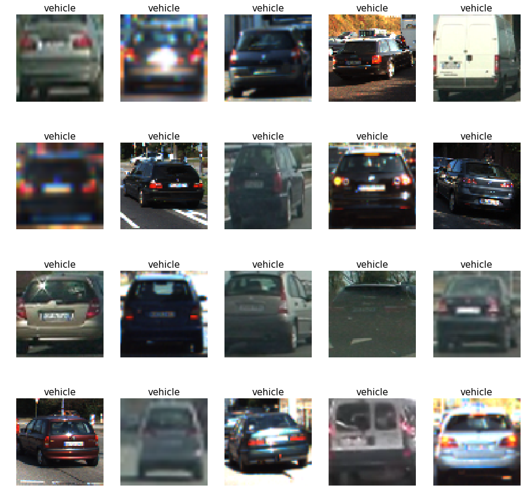
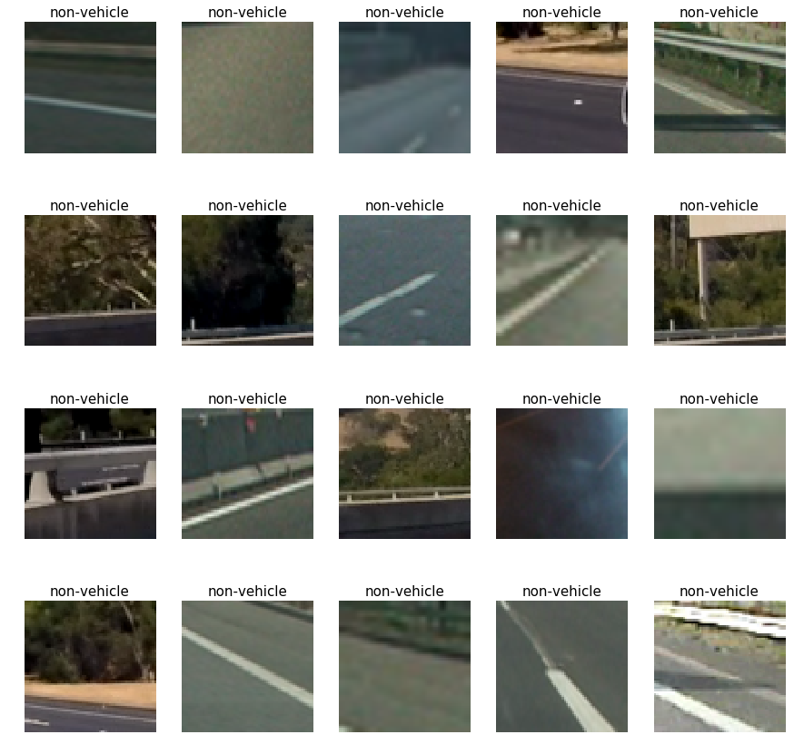

I then explored different color spaces and HOG parameters (`orientations`, `pixels_per_cell`, and `cells_per_block`). I grabbed the 200th image from each of the two classes and displayed them with the HOG images.
Here is an example using the `RGB` color space and HOG parameters of `orientations=9`, `pixels_per_cell=(8, 8)` and `cells_per_block=(2, 2)`:

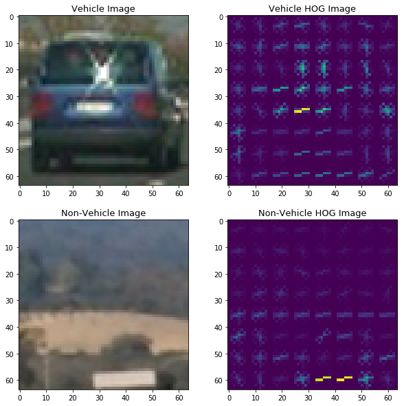

#### 2. Explain how you settled on your final choice of HOG parameters.

I tried several combinations of parameters and used the highest accuracy from SVM to find the best parameters.
In the following table, we find that 'orient = 11', 'pixpercell = 16' and 'hog channel_idx = all' generate the highest accuracy.

| Index | Colorspace | Orientations | Pixels Per Cell | Cells Per Block | HOG Channel | Accuracy |
| :-----------------: | :--------: | :----------: | :-------------: | :-------------: | :---------: | ------------:|
| 1                   | RGB        | 9            | 8               | 2               | all         | 96.21        |
| 2                   | HSV        | 9            | 8               | 2               | 0           | 92.15        |
| 3                   | HSV        | 9            | 8               | 2               | 1           | 94.72        |
| 4                   | LUV        | 10            | 8               | 2               | 1           | 95.18        |
| 5                   | LUV        | 10            | 8               | 2               | 2           | 93.24        |
| 6                   | HLS        | 9            | 8               | 2               | 1           | 95.19        |
| 7                   | HLS        | 9            | 8               | 2               | all           | 98.04        |
| 8                   | YUV        | 12            | 8               | 2               | 0           | 96.35        |
| 9                   | YUV        | 11            | 16               | 2               | all           | 98.37        |

#### 3. Describe how you trained a classifier using your selected HOG features (and color features if you used them).
The code for this step is contained in code cell 93 of the IPython notebook.
I generated the training and testing sets by stacking the positive and negative samples (labels) together, and then shuffled them before feeding them to a linear SVM classifier. The labeled data are separated into 75% for training, and 25% for testing. The detection results are from 96% to 98% in accuracy. 

### Sliding Window Search

#### 1. Describe how you implemented a sliding window search. How did you decide what scales to search and how much to overlap windows?
The code for this step is contained in code cell 95 of the IPython notebook.
Based on the function 'find_car' from udacity, I modified it a little bit to implement the sliding window algorithm.
The method includes HOG feature extraction and sliding window search. Instead of performing feature extraction from each window, we extracted the hog features from region of interest (lower half of the image), and then subsapmled them according to the window size and put them into a classifier. 

#### 2. Show some examples of test images to demonstrate how your pipeline is working.  What did you do to optimize the performance of your classifier? 

The code for this step is contained in code cell 99 and 103 of the IPython notebook.
The following results are generated using the heatmaps (which will be discussed in the next section in detail).
Initially, I used one scale to test on one image. The results are decent but two cars on the left of the image are missing. 

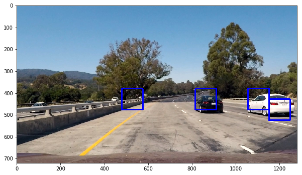

Then, I used two scales and the pipeline detected nearly all the vehicles without false alarms, and even vehicles overlapped with obstacles are found.

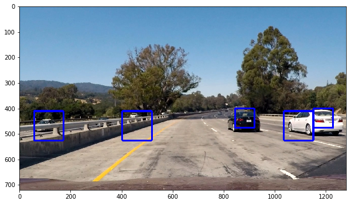

Ultimately I searched on 3-4 scales using YUV 3-channel HOG features, which provided nice results. Here are 6 example images:

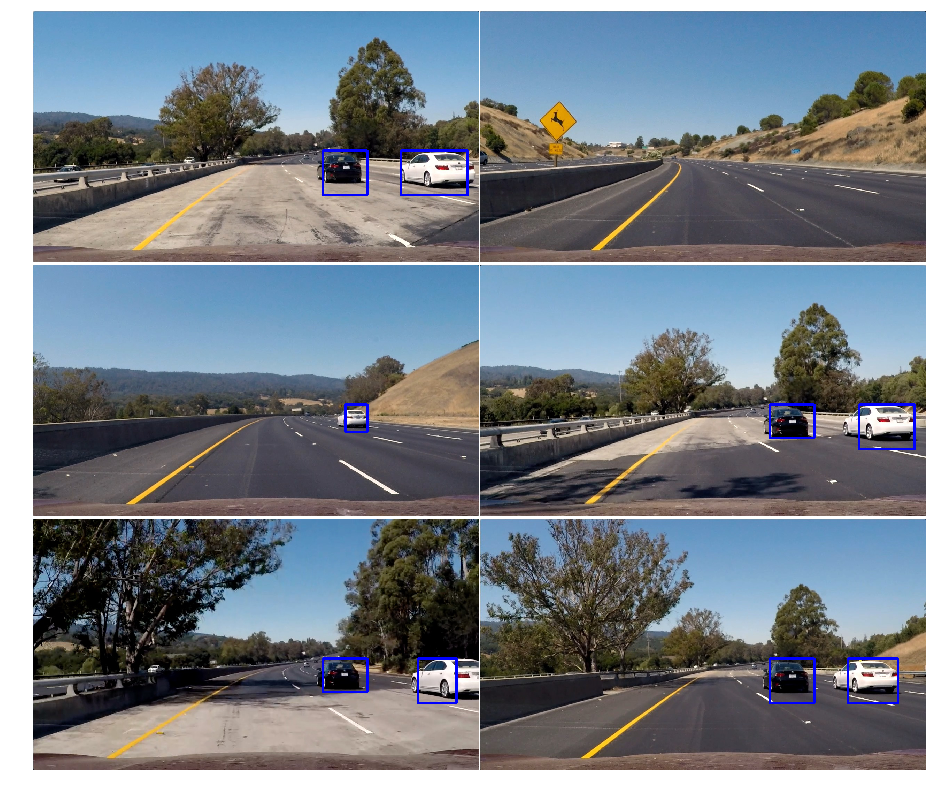

---

### Video Implementation

#### 1. Provide a link to your final video output. Your pipeline should perform reasonably well on the entire project video (somewhat wobbly or unstable bounding boxes are ok as long as you are identifying the vehicles most of the time with minimal false positives.)

Here's a [link to the short video result](https://github.com/akb46mayu/UdacitySelfDrivingCar_ND1/blob/master/VehicleDetection/out_test_video_recent.mp4).

Here's a [link to the long video result](https://github.com/akb46mayu/UdacitySelfDrivingCar_ND1/blob/master/VehicleDetection/out_project_video_recent1.mp4), where we only use one frame to compute the heatmap eachtime.

Here's a [link to the long video result](https://github.com/akb46mayu/UdacitySelfDrivingCar_ND1/blob/master/VehicleDetection/out_project_video_recent2.mp4), where we use the recently acquired 13-15 frames to compute the heatmap.

It can be seen from the video that by summing up previous frames' heatmaps, the advanced pipleline (recent2.mp4) is able to detect the white car better and reduce more false positive boxes than the pipeline (recent1.mp4) without using them.

#### 2. Describe how (and identify where in your code) you implemented some kind of filter for false positives and some method for combining overlapping bounding boxes.

The code for this step is contained in code cell 100 and 111 of the IPython notebook.
I recorded the positions of positive detections in each frame of the video. From the positive detections I created a heatmap and then thresholded that map to identify vehicle positions. I then identified individual blobs in the heatmap and assumed each blob corresponded to a vehicle. I constructed bounding boxes to cover the area of each blob detected. Here's an example result showing the heatmap from one frame of video, the result of `scipy.ndimage.measurements.label()` and the bounding boxes then overlaid on the last 
    frame of video:
To further reduce the number of false positives, I also used recently acquired frames (10-13 frames) to compute the heatmap instead of just one frame. It does reduce the number of false positive boxes in the video. 

Without using heatmaps, we get a lot of overlapped and redundant boxes:

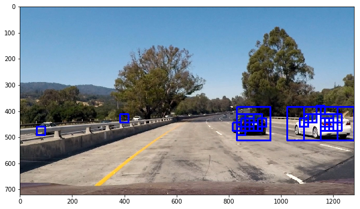

The corresponding integrated heatmap and its thresholded image (pixel intensity less than the threshold will be set to zero) are as follows:

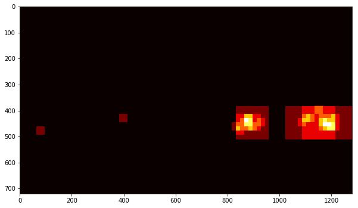
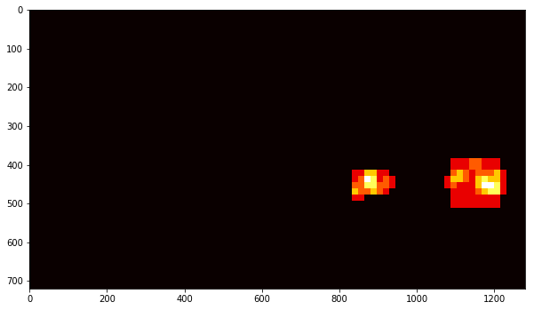

Here are the spatially contiguous areas of the heatmap (each contiguous area is assigned a label) and the image of resulting bounding boxes drawn onto the input frame:

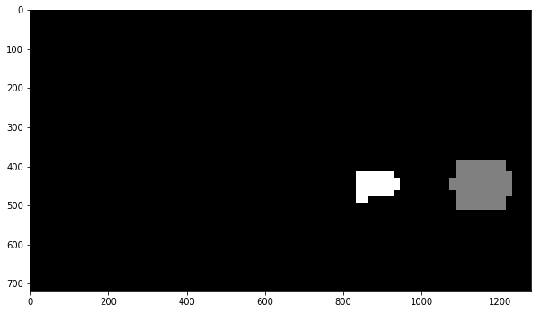
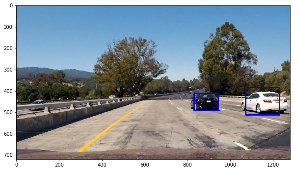

---

### Discussion

#### 1. Briefly discuss any problems / issues you faced in your implementation of this project.  Where will your pipeline likely fail?  What could you do to make it more robust?

The major issue was when I run my pipeline on the video, it showed 'shape object is empty'. I thought the code of find_car function might be incorrect, and it took me 3 hours to debug. In fact, nothing was wrong with the find_car function. But the values of the input parameters ystart and ystop were not valid. The ystart value should be always smaller than 'ystop', but I typed the values in mistake with ystart greater than ystop. 

Another issue was, in my first submission, my pipeline had a lot of false positive predictions between 25 and 30 seconds, and sometimes the white car could not be detected. After checking the code, I found the classifier I used in prediction had small accuracy of 96%.
So I used more training data and improved the accuracy to 98.3%. After that the false positive issues are solved and the white cars can be detected. I also carefully chose the window parameters to reduce more false positive boxes.

The pipeline will fail when the classifier is not well trained, and it can not handle objects from the left side quite well. 
In future work, I will collect more training sets and do data augmentation to improve the prediction accuracy of the classifier. I will also try more features apart from HOG, and use advanced deep learning models such as YOLO and SSD.

